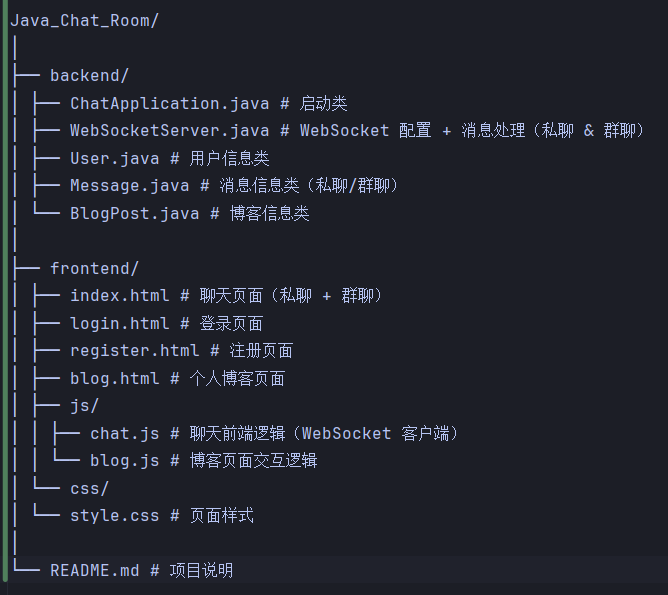

# Java_Chat_Room

## 项目简介
`Java_Chat_Room` 是一个基于 **Java + WebSocket** 的简易聊天室项目，包含以下功能模块：
1. **个人聊天**（私聊 & 群聊）
2. **个人博客**（查看与发布博客）
3. **用户管理**（登录与注册，由其他组员负责实现）

本项目主要用于大二软件工程/网络编程大作业练习，采用前后端分离的结构，前端使用 HTML + JS，后端使用 Java（Spring Boot 或普通 Java WebSocket 也可）。

---

## 项目目录结构




---

## 模块说明与组员分工

### 1. 后端模块（Java）
| 文件 | 功能 | 负责人  |
|------|------|------|
| `ChatApplication.java` | 启动整个后端服务 | 公共   |
| `WebSocketServer.java` | WebSocket 消息处理；维护在线用户列表；支持私聊与群聊 | x    |
| `User.java` | 用户信息实体类（用户名、密码等） | 组员 A |
| `Message.java` | 消息实体类（发送者、接收者、内容、类型、时间戳） | x    |
| `BlogPost.java` | 博客实体类（标题、内容、作者、时间） | x    |

**提示**：后端可使用简单的内存存储（如 `Map<String, User>` 或 `List<BlogPost>`）完成作业要求，无需数据库。

---

### 2. 前端模块（HTML + JS + CSS）
| 文件 | 功能 | 负责人   |
|------|------|-------|
| `index.html` | 聊天界面（私聊/群聊切换） | 你     |
| `login.html` | 登录页面 | 组员 B  |
| `register.html` | 注册页面 | 组员 B  |
| `blog.html` | 展示个人博客列表 & 新增博客表单 | x     |
| `chat.js` | 连接 WebSocket，发送/接收消息，显示在页面 | x     |
| `blog.js` | 博客页面交互逻辑（显示、发布博客） | x     |
| `style.css` | 页面样式 | 可全员协作 |

**前端提示**：
- 聊天页面需要区分私聊和群聊，可通过一个选择框或点击用户名发送私聊。
- 博客页面显示博客列表，提供表单输入新博客标题和内容。

---

## 消息数据结构示例

```java
public class Message {
    private String fromUser;      // 发送者
    private String toUser;        // 接收者（null 表示群发）
    private String content;       // 消息内容
    private String type;          // "private" / "group"
    private LocalDateTime time;   // 时间戳
}

## 测试方式

1. 启动 `ChatApplication.java` 后端服务。
2. 打开 `index.html`，输入用户名进行连接。
3. 使用多个浏览器或多个标签页打开，测试私聊与群聊功能。
4. 打开 `blog.html`，测试发布和查看博客功能。
